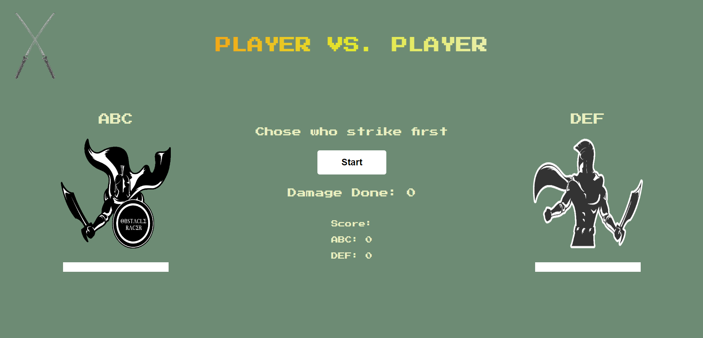

# Player vs. Player

Welcome to [Player vs. Player Game!](https://mihaielisei.github.io/Player-vs.-Player/)

# Introduction
Player vs. Player it is a small multiplayer game where two players attack eachother. Each player will have two attack options on each turn, each attack option deal a different amount of damage. First player that reach 3 points will win the game. 

The game was build only with HTML, CSS and JavaScript, and the main purpose of the project is to dynamically chage the DOM using only one HTML file.

Live version of the game [Player vs. Player.](https://mihaielisei.github.io/Player-vs.-Player/)

# Table of Contents

# 1. User Expereince (UX) design

* The game was build in only one HTML file and to every action of the user the HTML will update;
* The game is interactive, having nice specific images for each attack option;
* When a player reach 3 points score the game will reset;

# 1.1 User Goals

The game is designed for two players, they will have to random attack each turn, when a player reach 0 health loases the round, when a player reach 3 point score wins the game;

# 1.2 User Expectations

The content of the game changes at every action of a user. Folloiwng user's expections ware considered while designing the site:

* The site structure is designed considering the expectation of users to be simple and easy to use;
* The user interface is easy to navigate;
* Responsive design for all screen/device sizes like mobile, tablet and desktop;

# 1.3 Color Scheme

The choice of website right foreground and background colour is essential that decides the site visitors wheather to emote the site or not. I used [Color Hunt](https://colorhunt.co/) to select the background and foreground color. Colors that i used are:

* #6D8B74 - main background color;
* #E9EFC0, #e2e82e, #fa870c, #7b6919 linear gradient for Page Title animation;
* #E9EFC0 - text color;
* #fff - buttons background color;
* rgba(255, 255, 255, 0.5) - shadows;
* #000 - borders and instructions text color;
* green and red - form validation border.

# 1.4 Images and Logo

This website was created for academic purposes, all photos were searched and downloaded from [Giphy website](https://giphy.com/)

# 1.5 Site Skeleton
[Balsamiq](https://balsamiq.com/) was used to create wireframes of the website. This was very useful as it gives the template of the UI. Wireframes were designed for web browser and a mobile browser format:

## Main Page:

## Instructions 

## Form Page:

## Main Game

# 2.Features

# Main Section
* Logo is placed in the top left corner;
* For the game title I have created a animation that translate text background colors, the font family I used is 'Press Start 2P', this will give the game a bit of retro look;
* New Game and Instructions buttons are centered in the middle of the page;
* Social media links (Facebook, Instagram, Twitter and Youtube) are placed at the bottom of the page in the footer. All the links will be opened in a new tab.

The screenshots of Main Section are below:

# Form Section
* The form is centered on the middle of the page;
* If the imput is focused and empty red bottom border will appear;
* When the input is filled red border will change to green;
* Hover effect to the submit button.

# Game section
* Game section is divided in three sections : First player section, Second player section and middle section;
* On each player section is the name of the player, an image section , health bar and attack buttons;
* On the mid section are the start game and replay game buttons, score box and damage done displayed after each attack;
* Rock paper scissors game will be displayed once a start button is pressed or replay button is pressed. The game window is centered on the middle of the page and is divided in two sections where you will see each player option assigned automaticly.

The screenshots of Main Game are below:

# Winner section

* When a player reach 3 points score will win the game;
* The images for both players will update;
* On the screen will be fireworks;
* Name of the winner will be displayed and the home button;

# 3. Technologies Used

* HTML5 was used for structuring and presenting content of the website;
* CSS3 was used to provide the style to the content written in a HTML;
* JavaScript was used to give logic to the game;
* Balsamiq was used to create wireframes of the website;
* Google Fonts was used to import font-family 'Press Start 2P' into style.css file and which was used throughout the pages of the website;
* Chrome was used to debug and test the source code using HTML5 as well as to test site responsiveness;
* Github was used to create the repository and to store the cproject's code after pushed from Git;
* Git was used as the Code Editor for the site;
* Color Hunt was used to select the background and font color in the website;
* W3C Markup and Jigsaw validation tools were used to validate the HTML code and CSS style used in the proejct;
* JShint was used to validate JavaScript code;
* Ami was used to develop a Mockup screenshot generator.
